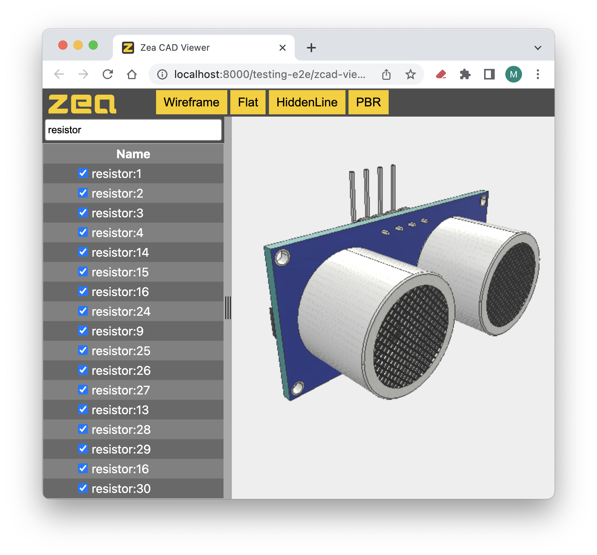

# zea-tree-view

The [zea-tree-view](https://github.com/ZeaInc/zea-tree-view) is a framework
agnostic tree view for displaying the scene tree from the [Zea Engine](https://github.com/ZeaInc/zea-engine).

The tree view is implemented as a custom element using
[custom elements](https://developer.mozilla.org/en-US/docs/Web/Web_Components#custom_elements),
and therefore it can be integrated into any modern web application development
framework, or used in a simple HTML page.

## Features

While there are many tree views out there that have nice features, these are some
features that are unique to the Zea tree view:

### Lazy loading

A small tree of a few hundred items can be displayed in any tree
view component. Trees made up of many 10s of thousands of items will become
usually slow. Due to the ability of Zea Engine to load and display massive
trees, generic tree view components will cause performance issues.
The zea-tree-view builds itself lazily, only generating the subtree as it is
expanded. This means that while a massive tree data structure can exist in
memory, the tree view only needs to show those parts of the tree that the user
has requested.

### Highlighting and interaction

The zea-tree-view is implemented as an [Observer](https://en.wikipedia.org/wiki/Observer_pattern)
of the `SceneTree`.
All changes made to the scene tree (highlighting, selection changes,
name changes, or any kind of tree structure manipulation) are instantly reflected
in the tree. The data model, which is the Zea Engine's `SceneTree`, can be updated
by any other component in your application, and the tree view will react and update
to reflect these changes.

### Instance and Reference display

The Zea Engine tree will contain instance items, with each instance item having
a single child which is its source reference.
Most users will expect that the instance of a reference is displayed
as a single item in the tree. The zea-tree-view has this logic built in, making
it a simple drop in solution (see below for more details).

### Debugging features

The zea-tree-view component comes with some handy debugging features that help
understand performance issues in large complex assemblies:

- Tree Weight debugging: after loading a massive assembly, it can be useful to
  understand the weight of the tree at each point to see where the complexity exists.
  This can help isolate broken geometries, or know where to prune if you are struggling
  to load your entire tree.
  
- Geometry weight debugging ([coming soon](https://github.com/ZeaInc/zea-tree-view/issues/14)):
  The tree can also display the total number of points, lines, and triangles
  displayed under a given node. This can help clarify the results of various
  precision settings used in the production of ZCAD files.

### Keyboard navigation

You can use the arrow keys to navigate the tree view, like this:

- Up: select the previous item.
- Down: select the next item.
- Right: expand the current item.
- Left: collapse the current item.

### Search

The image below demonstrates the results obtained after searching for the keyword "resistor".



You can press the Esc key to clear the search results.

### Multiple columns (coming soon)

### Free and OpenSource

Feel free to [fork](https://docs.github.com/en/get-started/quickstart/fork-a-repo)
[this repo](https://github.com/ZeaInc/zea-tree-view), make changes and use it in
your projects. You might even make a few improvements and provide us a
[Pull Request](https://docs.github.com/en/pull-requests/collaborating-with-pull-requests/proposing-changes-to-your-work-with-pull-requests/creating-a-pull-request)
to integrate these features back into the tree view.

## Templates using the zea-tree-view

Zea provides a few template applications that you can use as a foundation to build
your own applications.
These templates use the zea-tree-view custom element to display:

- [https://github.com/ZeaInc/zea-react-template](https://github.com/ZeaInc/zea-react-template)
- [https://github.com/ZeaInc/zea-svelte-template](https://github.com/ZeaInc/zea-svelte-template)
- [https://github.com/ZeaInc/minimal-zea-viewer](https://github.com/ZeaInc/minimal-zea-viewer)

For more information on custom elements, and how compatible your chosen framework
is with custom elements, the following page provides a great breakdown:
[https://custom-elements-everywhere.com](https://custom-elements-everywhere.com)

## Displaying an `InstanceItem` and its Reference in your own tree view

If you are using a custom tree view component and wish to display the Zea Engine
tree, we have some guidelines that will ensure your displayed tree aligns with your
users expectations:

### Determining the name to display for an `InstanceItem`

The name displayed in the tree view might not be the same as the name given to the
`TreeItem` in the tree. The reason for this is that names in Zea Engine must be unique,
while many CAD applications do not have this requirement.
This issue only affects InstanceItems, because an multiple instances may be nested
under a product or assembly.
Instances in most CAD applications may have no name at all, and therefore use the
reference items name, or have non-unique names. The Zea Engine C++ SDK generates
unique names while processing CAD assets, and assigns a `DisplayName` property if
the name provided by the CAD SDK was not valid for one of the reasons listed above.
The zea-tree-view component should use the `DisplayName` if available instead of
the provided name.
See the following code for an example:

```javascript
const displayNameParam = item.getParameter('DisplayName')
if (displayNameParam) {
  return displayNameParam.getValue()
}
return item.getName()
```

### Determining the children to display under an InstanceItem

The `InstanceItem` should be merged with its reference to provide a consistent tree
view that users will recognize. To achieve this, when displaying the child items
for an `InstanceItem`, the tree view should skip the reference item and display its
children instead. The zea-tree-view does this as shown in the following code:

[https://github.com/ZeaInc/zea-tree-view/blob/main/src/TreeView.js#L356-L370](https://github.com/ZeaInc/zea-tree-view/blob/main/src/TreeView.js#L356-L370)

[https://github.com/ZeaInc/zea-tree-view/blob/main/src/TreeView.js#L165-L189](https://github.com/ZeaInc/zea-tree-view/blob/main/src/TreeView.js#L165-L189)
